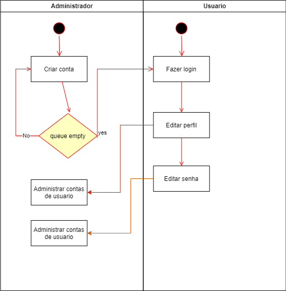

# Especificação do projeto

O presente projeto será desenvolvido utilizando React no frontend e Node.js no backend. O React, sendo uma biblioteca JavaScript popular para a criação de interfaces de usuário dinâmicas e componentes reutilizáveis, permitirá a construção de um aplicativo de biblioteca interativo e eficiente. A separação da lógica visual e funcional será gerenciada por CSS para estilizar os componentes React, mantendo a organização entre a estrutura e a aparência do aplicativo.No backend, utilizaremos Node.js, uma plataforma JavaScript que permite construir aplicativos escaláveis e eficientes no lado do servidor. Node.js será responsável pelo gerenciamento das operações de persistência de dados, interações com banco de dados e APIs, garantindo uma comunicação fluida entre o frontend e o backend.

## Personas

1. Lucas - Estudante Universitário
Idade: 21 anos
Curso: Administração de Empresas
Perfil: Lucas é um estudante dedicado que busca constantemente melhorar seu desempenho acadêmico. Ele frequenta a biblioteca regularmente para pesquisar livros e materiais que complementem suas aulas. Seu foco é otimizar seus estudos, especialmente nas disciplinas relacionadas à sua área.
Motivações: Encontrar rapidamente livros relacionados ao seu curso para aprofundar seu conhecimento e se preparar adequadamente para as avaliações.
Necessidades: Um sistema que permita a busca eficiente por livros específicos, com filtros por tema e disponibilidade.
Desafios: Lidar com a pressão acadêmica e a falta de tempo, tornando essencial o acesso rápido e prático a materiais relevantes.
Objetivos: Maximizar seu aprendizado e rendimento nas avaliações, utilizando os recursos da biblioteca de forma eficaz.

2. Maria - Professora Universitária
Idade: 38 anos
Disciplina: Psicologia
Perfil: Maria é uma professora apaixonada pelo ensino e pela promoção do conhecimento. Ela valoriza a formação contínua e busca sempre novos materiais para enriquecer suas aulas. Organiza atividades e discussões em sala que requerem acesso a livros e artigos específicos.
Motivações: Reservar livros que serão utilizados em suas aulas para garantir que seus alunos tenham acesso ao material necessário.
Necessidades: Um sistema que facilite a reserva de livros e o acesso a recomendações de leitura.
Desafios: Gerenciar o tempo entre a pesquisa de novos materiais e as obrigações acadêmicas, além de atender às necessidades de seus alunos.
Objetivos: Oferecer aulas dinâmicas e bem fundamentadas, utilizando materiais atualizados e relevantes.

3. Rafael - Coordenador de Ensino
Idade: 45 anos
Cargo: Coordenador de Graduação
Perfil: Rafael é responsável por monitorar o acervo da biblioteca e garantir que os materiais estejam sempre atualizados. Ele se comunica frequentemente com professores e alunos para entender suas necessidades e adaptar o acervo.
Motivações: Garantir a disponibilidade e a atualização dos livros na biblioteca para atender às demandas dos cursos.
Necessidades: Um sistema que possibilite o monitoramento da disponibilidade dos livros e a solicitação de novos títulos de forma prática.
Desafios: Lidar com orçamentos limitados e diferentes solicitações de diversos cursos, equilibrando as prioridades de aquisição.
Objetivos: Manter o acervo relevante e acessível, promovendo a excelência acadêmica na instituição.

4. Ana - Estudante de Graduação
Idade: 19 anos
Curso: Engenharia Civil
Perfil: Ana é uma estudante engajada, que valoriza a eficiência em suas atividades acadêmicas. Ela utiliza frequentemente a biblioteca, mas busca maneiras de economizar tempo no processo de renovação de livros e pesquisa de materiais.
Motivações: Renovar seus livros sem precisar ir até a biblioteca, facilitando sua rotina acadêmica.
Necessidades: Um sistema que permita a renovação online de empréstimos e a consulta à disponibilidade de livros.
Desafios: A pressão de prazos e a carga de trabalho intensa exigem que ela otimize suas tarefas diárias.
Objetivos: Reduzir a burocracia e maximizar o tempo para estudar e participar de atividades extracurriculares.

5. Carla - Professora de Educação
Idade: 35 anos
Disciplina: Literatura
Perfil: Carla é uma professora que acredita no poder da leitura para a formação integral dos alunos. Ela frequentemente recomenda livros e artigos para complementar suas aulas e estimular o interesse dos estudantes.
Motivações: Recomendar leituras relevantes e acessíveis para seus alunos, promovendo a formação crítica e o amor pela literatura.
Necessidades: Um sistema que permita fácil recomendação de livros e acesso a novos lançamentos.
Desafios: Encontrar materiais que estejam alinhados ao currículo e que despertem o interesse dos alunos.
Objetivos: Enriquecer suas aulas com materiais diversificados e relevantes, contribuindo para a formação de leitores críticos.

6. Fernanda - Coordenadora de Biblioteca
Idade: 40 anos
Cargo: Coordenadora de Biblioteca
Perfil: Fernanda é responsável por gerenciar o acervo e as operações da biblioteca. Ela lida diretamente com alunos e professores, buscando sempre entender suas necessidades para ajustar a oferta de livros e recursos.
Motivações: Acompanhar as solicitações de novos títulos e garantir que a biblioteca atenda às necessidades acadêmicas da instituição.
Necessidades: Um sistema que possibilite a visualização de solicitações de novos títulos e a atualização do acervo de forma prática.
Desafios: Conciliar a administração da biblioteca com as demandas variadas de diferentes cursos e professores.
Objetivos: Prover um acervo atualizado e diversificado, garantindo que a biblioteca seja um recurso valioso para a comunidade acadêmica.

7. Pedro - Desenvolvedor de Software
Idade: 28 anos
Profissão: Programador Freelancer
Perfil: Pedro é um desenvolvedor autodidata que está constantemente aprimorando suas habilidades em novas linguagens de programação e frameworks. Ele busca por livros técnicos, manuais e outros recursos de qualidade para expandir seus conhecimentos, além de também se interessar por conteúdos relacionados a soft skills e desenvolvimento pessoal. Pedro prefere fontes acessíveis que não dependam de assinaturas caras e plataformas fechadas.
Motivações: Melhorar suas competências técnicas, especialmente em áreas emergentes da tecnologia, como inteligência artificial, desenvolvimento mobile e segurança cibernética, além de aprimorar suas soft skills, como liderança e empreendedorismo.
Necessidades: Um sistema de biblioteca que ofereça uma ampla coleção de livros e manuais técnicos em desenvolvimento de software, além de materiais sobre desenvolvimento pessoal. A ferramenta deve permitir a busca por linguagens específicas, frameworks e temas de empreendedorismo e gestão de projetos.
Desafios: Achar fontes atualizadas, técnicas e confiáveis que estejam disponíveis em uma única plataforma, permitindo acesso fácil e rápido a materiais diversificados e pertinentes ao mercado de tecnologia.
Objetivos: Expandir suas habilidades em desenvolvimento de software e acessar uma biblioteca que ofereça conteúdos técnicos e de desenvolvimento pessoal, tudo de forma integrada e acessível, sem custos elevados.

8. Marcelo - Pesquisador de Mercado
Idade: 37 anos
Profissão: Pesquisador de mercado em uma agência de consultoria
Perfil: Marcelo é um profissional dedicado a analisar dados e tendências de mercado, com o objetivo de desenvolver relatórios estratégicos que ajudem seus clientes a tomar decisões informadas. Ele tem uma rotina intensa de pesquisa, revisando uma vasta gama de fontes, como livros acadêmicos, artigos, estudos de caso e relatórios de mercado, para fundamentar suas análises. Além disso, Marcelo valoriza muito a confiabilidade e a atualidade das informações que utiliza, garantindo que seus relatórios sejam baseados em dados sólidos e bem embasados.
Motivações: Ele busca otimizar o tempo dedicado à pesquisa, acessando rapidamente fontes confiáveis e robustas sem a necessidade de comprar ou utilizar bases pagas constantemente. A praticidade e a abrangência do material de pesquisa disponível são fatores essenciais para ele.
Necessidades: Marcelo precisa de um sistema de gestão de biblioteca que ofereça um extenso acervo de recursos digitais, como e-books, artigos científicos e relatórios de mercado, com uma interface que permita a busca rápida e o uso de filtros avançados para temas específicos e relevantes à sua pesquisa.
Desafios: Seu principal desafio é encontrar fontes que não só sejam confiáveis e de alta qualidade, mas que também estejam atualizadas e possam ser acessadas sem barreiras financeiras, já que ele lida com prazos curtos e relatórios que exigem uma abordagem precisa e atualizada.
Objetivos: Marcelo deseja acessar, com rapidez, material de apoio relevante para seus estudos e análises de mercado, sem depender de plataformas pagas ou complicadas. Ele busca integrar o sistema de biblioteca como uma ferramenta essencial para validar suas conclusões e enriquecer seus relatórios de forma prática e acessível.

## Histórias de usuários

Com base na análise das personas, foram identificadas as seguintes histórias de usuários:

|EU COMO... `PERSONA`               | QUERO/PRECISO ... `FUNCIONALIDADE`                                  |PARA ... `MOTIVO/VALOR`                                       |
|-----------------------------------|---------------------------------------------------------------------|--------------------------------------------------------------|
|Eu como estudante Universitario    | Quero encontrar rapidamente os livros relacionados ao meu curso     | para otimizar meus estudos em assuntos específicos.          |
|Eu, como professor                 | Desejo reservar livros para minhas aulas                            | Para lecionar minhas aulas                                   |
|Eu, como unidade de ensino         | Desejo monitorar a disponibilidade dos livros                       | Para garantir que o acervo esteja sempre atualizado          |  
|Eu como estudante                  | Quero renovar meus livros sem ter que comparecer a biblioteca       | Para economizar tempo e diminuir a burocracia                |
|Eu como estudante                  | Quero receber notificações quando os livros que reservei estiverem disponiveis  | para otimizar meus estudos em assuntos específicos.|
|Eu como professor                  | Desejo poder recomendar leituras                                    | Para facilitar o acesso ao material complementar que considero importante|
|Eu, como unidade de ensino         | Quero poder acompanhar as solicitações de novos títulos             | Para assim poder ajustar o acervo de acordo com as necessidades       |
|Eu como estudante   | Desejo poder acessar artigos acadêmicos diretamente pela app       | Preciso de fontes confiáveis e atualizadas para minhas pesquisas           |
|Eu como estudante   | Quero encontrar rapidamente os     | para otimizar meus estudos em          |
|Universitario       | livros relacionados ao meu curso   | assuntos específicos.                  |

## Requisitos

As tabelas a seguir apresentam os requisitos funcionais e não funcionais que detalham o escopo do projeto.

### Requisitos funcionais

|ID    | Descrição do Requisito  | Prioridade |
|------|-----------------------------------------|----|
|RF-001| O sistema deve permitir o cadastro completo de livros | ALTA | 
|RF-002| O sistema deve possibilitar o gerenciamento do acervo | ALTA |
|RF-003| O sistema deve oferecer a funcionalidade de renovação de empréstimos  | ALTA |
|RF-004| O sistema deve permitir o empréstimo de livros | ALTA |
|RF-005| O sistema deve possibilitar o pagamento de multas por atrasos na devolução de livros  | BAIXA |
|RF-006| O sistema deve notificar os usuários sobre prazos de devolução, renovação ou reserva de livros | MEDIA |
|RF-007| O sistema deve permitir a reserva de livros | ALTA |
|RF-008| O sistema deve suportar a devolução de livros | ALTA |
|RF-009| O sistema deve oferecer fóruns ou bate-papos onde os usuários possam interagir | BAIXA |
|RF-010| O sistema deve permitir que os usuários adicionem livros à uma lista de favoritos | BAIXA |
|RF-011| O sistema deve garantir o acesso a conteúdos digitais | MEDIA |
|RF-012| O sistema deve permitir o cadastro de usuários  | ALTA |
|RF-013| O sistema deve manter um histórico de leitura e empréstimos  | BAIXA |

### Requisitos não funcionais

|ID     | Descrição do Requisito  |Prioridade |
|-------|-------------------------|----|
|RNF-001| Disponibilidade: O sistema deve ter uma disponibilidade, garantindo que os usuários possam acessar o aplicativo a qualquer momento. | MÉDIA | 
|RNF-002| Usabilidade: A interface do aplicativo deve ser intuitiva e fácil de usar, independentemente do nível de habilidade do usuário com tecnologia. |  ALTA |
|RNF-003| Confiabilidade: O sistema deve garantir a integridade dos dados, prevenindo a perda ou corrupção de informações, especialmente em operações críticas como empréstimos e reservas de livros. |  ALTA |
|RNF-004| Desempenho: O sistema deve ser capaz de responder às solicitações dos usuários em no máximo 5 segundos, garantindo uma navegação fluida e sem atrasos, mesmo em momentos de pico de acessos. |  MÉDIA |
|RNF-005| Manutenção: O código deve ser modular e bem documentado para facilitar futuras manutenções, atualizações e possíveis expansões de funcionalidades, permitindo que desenvolvedores possam facilmente compreender e modificar o sistema. |  BAIXA |

## Restrições

As questões que limitam a execução desse projeto e que se configuram como obrigações claras para o desenvolvimento do projeto em questão são apresentadas na tabela a seguir.

|ID| Restrição                                             |
|--|-------------------------------------------------------|
|001|O projeto deverá ser entregue no final do semestre letivo, não podendo extrapolar a data de 09/12/2024. |
|002|A equipe não pode subcontratar o desenvolvimento do trabalho.       |
|003|Todos da equipe devem desenvolver.       |

## Diagrama de casos de uso

O diagrama de casos de uso é o próximo passo após a elicitação de requisitos. Ele utiliza um modelo gráfico e uma tabela com as descrições sucintas dos casos de uso e dos atores. O diagrama contempla a fronteira do sistema e o detalhamento dos requisitos funcionais, com a indicação dos atores, casos de uso e seus relacionamentos.

As referências abaixo irão auxiliá-lo na geração do artefato “diagrama de casos de uso”.
.
> **Links úteis**:
> - [Criando casos de uso](https://www.ibm.com/docs/pt-br/engineering-lifecycle-management-suite/design-rhapsody/10.0?topic=cases-creating-use)
> - [Como criar diagrama de caso de uso: tutorial passo a passo](https://gitmind.com/pt/fazer-diagrama-de-caso-uso.html/)
> - [Lucidchart](https://www.lucidchart.com/)
> - [Astah](https://astah.net/)
> - [Diagrams](https://app.diagrams.net/)
